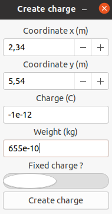

# Helpbox Simulator

## Use the program

### Create a specific charge

Click on the `create charge(s)` button.
A new window will appears and you will be able to select the different characteristics of the charge :

##### Coordinates
The coordinates are the position of the charge on the grid.
It's mesured in meters (m).
You can choose coordinates between -12 and 12 for ordinate's axis and between `-20 and 20` for abscissa's axis with a `step of 0.01` meter.

##### Force
The force is the coulomb force of the charge, it is set in Coulombs (C).
Because this zone is a free entry type zone, you can write the value you want `up to 50 characters` with "regular" notation or scientific notation.

##### Weight
The weight is the mass of the charge in grams (g).
The maximum's weight is always positive.
Because this zone is a free entry type zone, you can write the value you want `up to 50 characters` with "regular" notation or scientific notation.

**We advise to not go for a number smaller 1E-35 because C language has some difficulties with very small numbers.**

##### Fixed charge
Fixed charge is a switch button which allows you to choose if the charge will be fixed or mobile.
It is selected mobile by default.

**/!\ This is orthonormal Cartesian coordinates system**

**Once all your parameters are sets, click `Create charge`, your charge is on the grid !**

### Modify or delete a charge

To modify the attributs of a charge or delete it, click on the charge you have placed on the grid.
A window will pop out and you will be able to modify the charge's parameters.
Once it is done, click on the `Modify charge` button.

If you want to delete the charge, click on the `Delete charge` button.

### Generate a random charge system

If you want to generate a random charge system to try the program without creating each charge one by one, click on the `Generate charge(s)` button.

Then, select the number of mobile and mobile charge you want to randomly generate.

**Info: During generation, charge's symbol ratio is 50 purcents negative and 50 purcents positive.**

### Start a simulation

Once you have placed all your charges, selected all their characteristics, you can launch the simulation with the `Start` button.

**/!\ Once you have clicked the start button, the simulation is running, you will not be able to interact with the charges. All you will be able to do is stopping the simulation.**

### Reset the grid

Click on the `Reset` button.
The grid has been completed wiped from every charges.

## Limits of the program
We have set some limits in our program :

###### Simulation time
We have set a maximum simulation time of 180 000 milliseconds (3 minutes).
We felt that this time lapse was a decent compromise.

##### Maximum number of charges
We have set the maximum number of charges to 50 charges in total.
In our opinion it is enough for the purpose of using which is education.