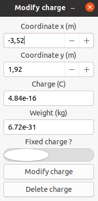
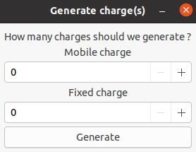

# Helpbox Simulator

## Use the program

***

### Create a specific charge

Click on the `create charge(s)` button.
A new window will appears and you will be able to select the different characteristics of the charge :

- `Coordinate x` is the abscissa of the charge,
- `Coordinate y` is the ordinate of the charge,
- `Force` is the force of the charge (N)
- `Weight` is the weight of the charge (g)
- `Fixed charge` is a switch which allow you to choose if the charge will be static or dynamic

**/!\ This is orthonormal Cartesian coordinate system**

**Once all your parameters are sets, click `Create charge`, your charge is on the grid !**

### Modify or delete a charge

To modify the attributs of a charge or delete it, click on the charge you have placed on the grid.
A window will pop out and you will be able to modify the charge's parameters. 
Once it is done, click on the `Modify charge` button.
  
If you want to delete the charge, click on the `Delete charge` button.

### Generate a random charge system

If you want to generate a random charge system to try the program without creating each charge one by one, click on the `Generate charge(s)` button.

Then, select the number of charge you want to randomly generate.

### Reset the grid

Click on the `Reset` button.
The grid has been completed wiped from every charges.